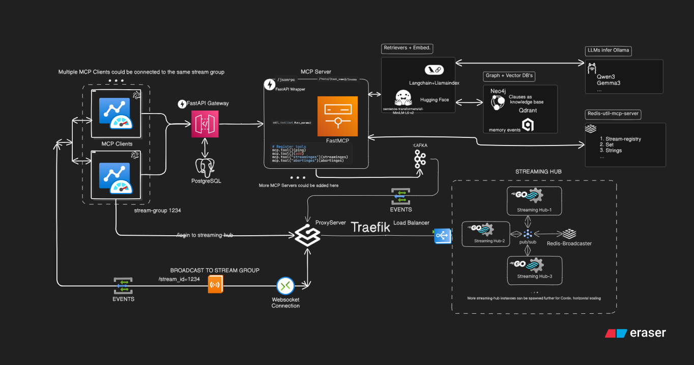

# JSentrix (C) 2025 Jasmeet Singh Bali GPL V3
# Autonomous Transaction Monitoring & Fraud Response System (Private, Multi-Agent, MCP&A2A-Compliant)

### 📌 Overview

This project is a fully local, privacy-preserving, multi-agent system for real-time transaction monitoring and fraud response with approach rule based agentic graph system (AGS) built for use case with bank/fintech IT teams and can be further extended and inspired from to develop fully customizable multi agentic and multi modal flow in other domains.  
It leverages the **Model Context Protocol (MCP)** for modular integrations, runs all AI models and data stores locally, and features an **Electron desktop app** (for IT staff) for monitoring.

---

## 🏭 Architecture



- **Typescript Electron App(MCP-client):** Local desktop app for IT staff, with embedded MCP client for analysis and tasking dashboard for monitoring transactions, alerts, and agent actions.
- **Python MCP Server(s):** fastMCP server wrapped by fastapi  that exposes tools and agents via MCP and A2A compliance agent-to-agent comms; handles transaction ingestion, agent orchestration, and local AI Triage Agent flow.
- **Gateway FastAPI:** Act a minimal proxy gateway service that enables interaction between MCP Server and Electron app.
- **Go+Fiber Streaming Hub with traefik setup:** Acts as centralized real time notification and event dispatcher knitted with kafka and redis fan out pub-sub pattern with multiple streaming-hub instance scalability for each client asssociated to streaming-hub get all events and behind traefik
- **Local Data/Models/LLM:** All LLMs (Ollama), vector DB (Qdrant), and graph clause memory (neo4j) run locally-no cloud or API keys.

---

## 🚦 End-to-End Flow

1. **IT staff launches Electron app** on their workstation.
2. **Electron MCP client** connects to the local MCP server via localhost.
3. **User triggers transaction ingestion/analysis** from the Electron UI.
4. **MCP server** fetches transactions from a local data source (CSV, database, or direct feed).
5. **Fraud detection agent** (local LLM) analyzes transactions for suspicious patterns.
6. **If fraud is suspected:**
   - **A2A workflow:**  
     - Intake Agent starts the stream for consuming txn from the target source as per end-user instructions
     - Assessment Agent gathers more context (prior memory events and history) along with filtering and passing the high priority transactions only to the action/agent.
     - Action/analysis agent infers the knowledge base with the provided context from assessment agent and llm inference and  prepares freeze/escalation actions and automatically executes appropriate actions immediately for voilating txns without human intervention.
     - Action agent output is finally passed to Judge agent for further human in loop downstream flows along with summarization and report via summarizer model for txns that are non-conclusive by the action agent  
7. **User reviews and approves/denies actions** in the Electron app.
8. **All actions, alerts, and transaction statuses** are visible in real time on Electron app dashboard.

---

## 💫 What is home-brew(in-house just used open source depend to make it alive though) !!

- [x] a real time use case project how an AI system can be engineered to automate and augment human capabilities in a tx analysis system that is based on business compliance/clauses  
- [x] custom knowledge base prep and ingestion pipeline
- [x] custom retrieval pipelines with score&decay, reranking, filter+metadata ...
- [x] triage custom flow setup with multistep intake of txn streams
- [x] each stream_id gets an isolated Intake → Assessment → Action agent flow,
enabling per-client control, scaling, and state encapsulation
- [x] minimal but effective a2a compliant agent-to-agent communication inspired by agent card and mcp compliance protocols
- [x] self-improving event memory store to improve system analysis capacity the more it analyze the txn streams as time progresses to improve system for the next time it analyze the txns

---


## 💫 Core Features

- **Local-Only Operation:** No third-party APIs or cloud dependencies; all data, models, and memory are local.
- **MCP-Based Integration:** Modular, protocol-driven access to data sources and tools.
- **Multi-Agent System:** Context- and memory-rich agents (fraud detection, investigation, notification, action) collaborating via A2A.
- **Electron Desktop App:** Cross-platform, user-friendly interface for IT staff, with embedded MCP client.
- **Electron Monitoring Dashboard:** Real-time visualization of transactions, alerts, and agent actions.
- **Audit & Logging:** Full traceability of actions and agent decisions.
- **Dockerized Deployment:** One-command setup for all components.

---


## 💡 Getting Started

1. **Clone the repo and follow setup instructions for each component in the next step.**
2. **Start the MCP server and supporting services (Ollama, neo4j) via Docker or local a/c to instructions.**
```bash
# start up postgres,neo4j,qdrant,redis,kafka and dockerized streaming-hub with traefik  docker instance from root jsentrix
docker-compose up -d

# startup ollama qwen3 model locally in terminal
ollama pull qwen3:1.7b # only the first time
ollama run qwen3:1.7b

# makes sure venv is activated and .env is set for each of the backend components
# mcp_server
python -m interface.mcp_server --http

# gateway (super user is auto created everytime the gateway fastapi service startsup with mcp_server health check and accessibility)
uv run ./src/main.py

# frontend electron app startup
# mcp-client
npm run start

#qwen3
http://localhost:11434 # local api qwen3

# neo4j
http://localhost:7474

# qdrant ui
http://localhost:6333/dashboard

# gateway
http://localhost:8080/docs

# mcp_server
http://localhost:9001

# streaming-hub (exposed via traefik with Load balancer not directly)
http://localhost/health

# to prep neo4j knowledge base with initial clauses manually
# 💫 though mcp_server takes care of this automatically on server startup just put a sample_clause.pdf inside data dir
python generate_sample.py # generate data/sample_clause.pdf
python application/run_pipeline.py # generate sample_clause.md and prep and injest knowledge base neo4j

# access swagger docs for running dockerized scalable streaming-hub golang fiber app
http://localhost/swagger

# check docker disk usage
docker system df
# remove all unused containers, images, networks, and build cache
docker system prune
```


---

## 🎯 JSentrix Milestones Tracks

|V1 Track | Milestone                                                                                      |  
|------|----------------------------------------------------------------------------------------------- |  
| 1    | ~~Scaffold Electron app (React/TypeScript), set up Python MCP server, connect via localhost.~~                                                                                                      |
| 2    | ~~Setup custom neo4j, retriever interface for both llamaindex and langchain agent support~~    |
| 3    | ~~Implement transaction ingestion tool (local DB/CSV/pdf) unstructure+langchain+docling~~                                                                                              |
| 4    | ~~optimiz and expand retrieval interface with relationship traversal cypher utils~~            |
| 5    | ~~custom flow setup including relevance decay score sort, summarization,memory aware querying~~                                                                                              |
| 6    | ~~add async support for retrievers, postprocessors, utils downstream pipelines~~               |
| 7    | ~~sphinix doc and instrumentation with opentellemetry setup~~                                         |
| 8    | ~~Setup reusable BaseAgent class interface with mcp+a2a compatibility for across all agent in system~~|
| 9    | ~~Setup support jsonrpc2.0 for comm b/w gateway and mcp_server with rest backw compat~~                                                                                                |
| 10    | ~~Setup streminges and abortinges tool for mcp server  and its peripheral setup with e2e websocket and streaming support with integ of kafka and redis pub/sub~~                                           |
| 11    | ~~Intake Agent setup with message input/output integ with prior memory event, enriched txn data to be passed to next phase as list of enriched transactions to the langchain Assessment & Prioritization Agent~~   |
| 12    | ~~Setup Assessment Agent and its peripherals e2e logs shud be streamed for both intake and assessment agent seprately~~                                                                                             |
| 13    | ~~Add A2A comm workflow i.e Assessment & Prioritization Agent comm with Analysis /Action Agent via a2a protocol internally inside the mcp_server with logs of action agent seprately streamed to ui~~                                                                                                    |
| 14    | polish Electron panels, loader, toast, split RootWrapper, vertical+horizontal split UI + streaming mode support and bug fixes + sidebar + add snapshot for v1 ui + recording for default,caching, async redisstream modes working under 1 min each mode video and add gifs and screenshots                                                                                           |
```bash
===== JSentrix v2.0 NOTE- to research on the 🎈 Abstracted Phases for Triage Flow current approach thoroughly before moving forward here tweak and finalize then move forward with below milestones====
```
|V2 Track | Milestone                                                                                      |  
|---------|----------------------------------------------------------------------------------------------- |  
| 15      | Setup Judge agent and its comm from action agent for ND txns flow check nuances/dev.md reff: 🎈 Abstracted Phases for Triage Flow section for flow along with strucutred txn output to be passed to gemini summarizer                                                                                              |
| 16      | visual agent graph tool invocation with xy react flow payload intake-assessment-action agent logs reff RootWrapper Bottom panel XY react flow visual                                                      |
| 17      | implement RAG HyDE (Hypothetical Document Embeddings) strategy approach ideally at the Intake level need to reserach and brainstorm it more in reff to the e2e flow                                   |

---

## ⚙️ Tech Stack

- **Electron+Typescript** (React/TypeScript) - Desktop app & MCP client
- **Python+FastMCP+FastAPI** - MCP server, agent orchestration via Langchain
- **Golang+Fiber+Traefik** - Fiber streaming-hub multiple replicas with traefik as proxy server and load balancer
- **Ollama** - Local LLMs for analysis(qwen3:1.7b) + summary(Gemma3:1b)
- **Langchain + Llamaindex** - for Triage Self improving custom agent setup with MCP and a2a compliance and custom agent orchestration and jsentrix custom flow setup with custom retrievers, score and decay patterns, reranking etc...
- **neo4j** - Local graph database for knowledge base clauses
- **postgresql** - Client/Electron user login both admin/non-admin users via gateway
- **qdrant** - store past inferenced and processed events stored in memory for future txn processing in triage self improving jsentrix flow
- **redis** - pub/sub channel broadcasting internal streaming-hub with FAN out pattern sending single consumed message by kafka partition to other streaming-hub replica subscribers of process,events by mcp_server and its agents to client electron ui realtime events streaming via websocket
- **kafka** - single/dedicated streaming-hub replica for consuming events published/forwarded by mcp_server agents and processes
- **Docker** - Deployment and local orchestration
- **Sphinix** - Docs
- **OpenTelemetry** Tracing and Instrumentation

---

## 🔃 Tech/Tools/Framework Doc References

- [MCP Protocol](https://github.com/anthropics/mcp)
- [Ollama](https://ollama.com/)
- [Langchain](https://python.langchain.com/docs/introduction/)
- [LlamaIndex](https://docs.llamaindex.ai/en/stable/#introduction)
- [Neo4j](https://neo4j.com/docs/operations-manual/current/docker/introduction/)
- [Qdrant](https://qdrant.tech/documentation/)
- [Electron](https://www.electronjs.org/)
- [Sphinix](https://www.sphinx-doc.org/en/master/usage/installation.html#pypi-package)
- [OpenTelemetry](https://opentelemetry.io/docs/languages/python/)
---


## License

[](https://choosealicense.com/licenses/gpl-3.0/)


